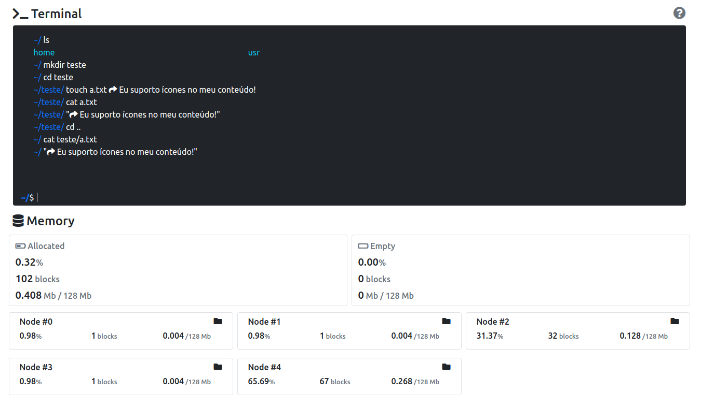

# soconsole

# VueFileManagaerConsole

Projeto da faculdade para cadeira de Sistemas Operacionais.
Simule o controle de arquivos com esse simulador feito em Vue.


**[Demo](https://VueFileManagerDist.miscerewebdev.repl.co)**


## Desenvolvedores

- Nicolas Bortoluzzi
- Iago Almeida

## Tecnologias Usadas

- Vue.js
- Bootstrap 5

## Project setup
```
npm install
```

### Compiles and hot-reloads for development
```
npm run serve
```

### Compiles and minifies for production
```
npm run build
```

### Lints and fixes files
```
npm run lint
```

### Customize configuration
See [Configuration Reference](https://cli.vuejs.org/config/).
