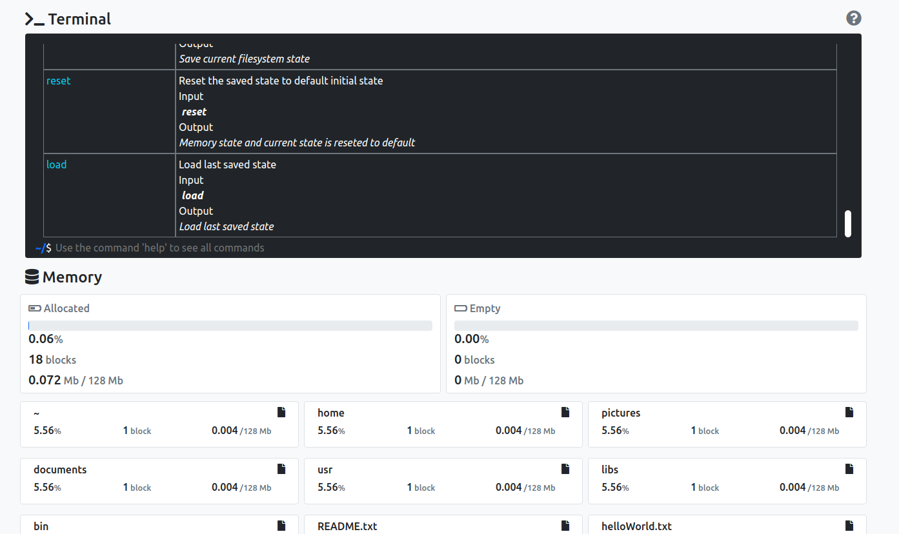

# soconsole

# VueFileManagerConsole

Projeto da faculdade para cadeira de Sistemas Operacionais.
Simule o controle de arquivos com esse simulador feito em Vue.


**[Demo](https://VueFileManagerDist.miscerewebdev.repl.co)**


## Desenvolvedores

- Nicolas Bortoluzzi
- Iago Almeida

## Tecnologias Usadas

- Node.js
- Vue.js
- Bootstrap 5

## Como usar

### Instalar dependências
```
npm install
```

### Rodar o servidor local
```
npm run serve
```

